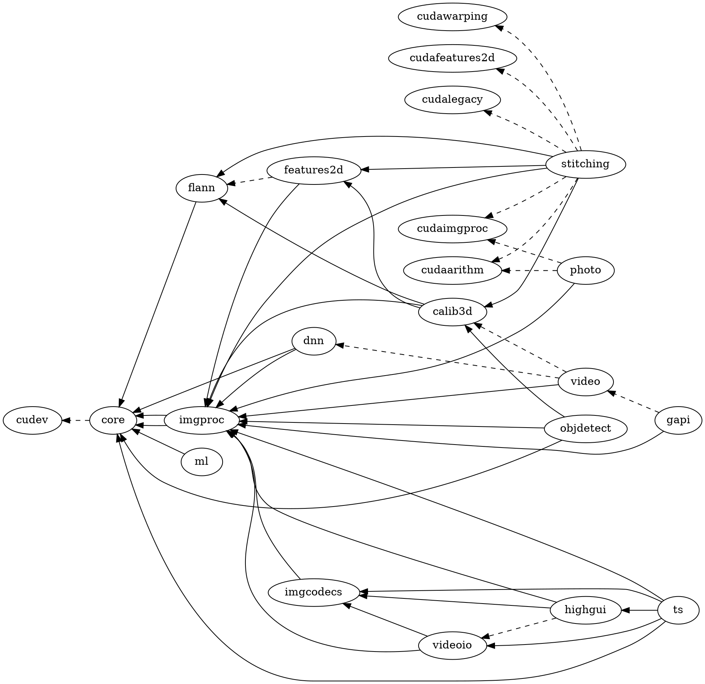

# opencv_dependency
Rust code snippet to create an OpenCV dependency graph as DOT (Graphviz) 

```dot
digraph "OpenCV Dependencies" {
  graph [
    rankdir=RL
  ]
  "calib3d" -> { "imgproc" "features2d" "flann" }
  "core" -> { "cudev" } [style="dashed"]
  "dnn" -> { "core" "imgproc" }
  "features2d" -> { "imgproc" }
  "features2d" -> { "flann" } [style="dashed"]
  "flann" -> { "core" }
  "gapi" -> { "imgproc" }
  "gapi" -> { "video" } [style="dashed"]
  "highgui" -> { "imgproc" "imgcodecs" }
  "highgui" -> { "videoio" } [style="dashed"]
  "imgcodecs" -> { "imgproc" }
  "imgproc" -> { "core" }
  "imgproc" -> { "core" }
  "ml" -> { "core" }
  "objdetect" -> { "core" "imgproc" "calib3d" }
  "photo" -> { "imgproc" }
  "photo" -> { "cudaarithm" "cudaimgproc" } [style="dashed"]
  "stitching" -> { "imgproc" "features2d" "calib3d" "flann" }
  "stitching" -> { "cudaarithm" "cudawarping" "cudafeatures2d" "cudalegacy" "cudaimgproc" } [style="dashed"]
  "ts" -> { "core" "imgproc" "imgcodecs" "videoio" "highgui" }
  "video" -> { "imgproc" }
  "video" -> { "calib3d" "dnn" } [style="dashed"]
  "videoio" -> { "imgproc" "imgcodecs" }
}
```

