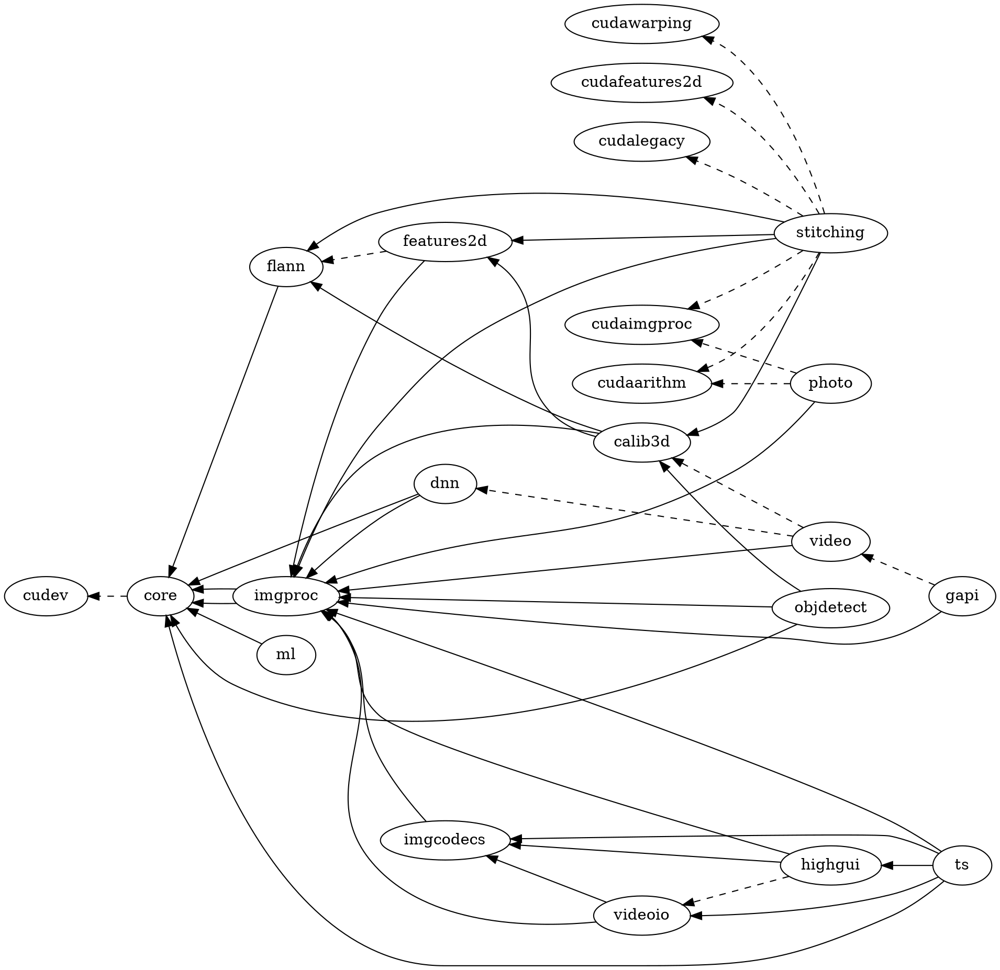

# opencv_dependency
Rust code snippet to create a dependency graph of OpenCV modules as DOT (Graphviz) 

## opencv/opencv
https://github.com/opencv/opencv

## opencv/opencv_contrib
https://github.com/opencv/opencv_contrib

```dot
digraph "OpenCV Dependencies" {
  graph [
    rankdir=RL
  ]
  "alphamat" -> { "core" "imgproc" }
  "aruco" -> { "core" "imgproc" "calib3d" }
  "bgsegm" -> { "core" "imgproc" "video" "calib3d" }
  "bioinspired" -> { "core" }
  "bioinspired" -> { "highgui" } [style="dashed"]
  "ccalib" -> { "core" "imgproc" "calib3d" "features2d" "highgui" }
  "cnn_3dobj" -> { "core" "imgproc" }
  "cnn_3dobj" -> { "features2d" "viz" "calib3d" } [style="dashed"]
  "cudaarithm" -> { "core" }
  "cudaarithm" -> { "cudev" } [style="dashed"]
  "cudabgsegm" -> { "video" }
  "cudacodec" -> { "core" "videoio" }
  "cudacodec" -> { "cudev" } [style="dashed"]
  "cudafeatures2d" -> { "features2d" "cudafilters" "cudawarping" }
  "cudafilters" -> { "imgproc" "cudaarithm" }
  "cudaimgproc" -> { "imgproc" }
  "cudaimgproc" -> { "cudev" "cudaarithm" "cudafilters" } [style="dashed"]
  "cudalegacy" -> { "core" "video" }
  "cudalegacy" -> { "objdetect" "imgproc" "calib3d" "cudaarithm" "cudafilters" "cudaimgproc" } [style="dashed"]
  "cudaobjdetect" -> { "objdetect" "cudaarithm" "cudawarping" }
  "cudaobjdetect" -> { "cudalegacy" } [style="dashed"]
  "cudaoptflow" -> { "video" "optflow" "cudaarithm" "cudawarping" "cudaimgproc" }
  "cudaoptflow" -> { "cudalegacy" } [style="dashed"]
  "cudastereo" -> { "calib3d" }
  "cudawarping" -> { "core" "imgproc" }
  "cudawarping" -> { "cudev" } [style="dashed"]
  "cvv" -> { "core" "imgproc" "features2d" }
  "datasets" -> { "core" "imgcodecs" "ml" "flann" }
  "datasets" -> { "text" } [style="dashed"]
  "dnn_objdetect" -> { "core" "imgproc" "dnn" }
  "dnn_objdetect" -> { "highgui" "imgcodecs" } [style="dashed"]
  "dnn_superres" -> { "core" "imgproc" "dnn" }
  "dnn_superres" -> { "quality" } [style="dashed"]
  "dpm" -> { "core" "imgproc" "objdetect" }
  "dpm" -> { "highgui" } [style="dashed"]
  "face" -> { "core" "imgproc" "objdetect" "calib3d" }
  "freetype" -> { "core" "imgproc" }
  "fuzzy" -> { "imgproc" "core" }
  "hdf" -> { "core" }
  "hfs" -> { "core" "imgproc" }
  "img_hash" -> { "imgproc" "core" }
  "intensity_transform" -> { "core" "imgproc" }
  "line_descriptor" -> { "imgproc" }
  "line_descriptor" -> { "features2d" } [style="dashed"]
  "mcc" -> { "core" "imgproc" "calib3d" "dnn" }
  "optflow" -> { "core" "imgproc" "calib3d" "video" "ximgproc" "imgcodecs" "flann" }
  "ovis" -> { "core" "imgproc" "calib3d" }
  "phase_unwrapping" -> { "core" "imgproc" }
  "plot" -> { "core" "imgproc" }
  "quality" -> { "core" "imgproc" "ml" }
  "rapid" -> { "core" "imgproc" "calib3d" }
  "reg" -> { "imgproc" "core" }
  "rgbd" -> { "core" "calib3d" "imgproc" }
  "rgbd" -> { "viz" } [style="dashed"]
  "saliency" -> { "imgproc" "features2d" }
  "sfm" -> { "core" "calib3d" "features2d" "xfeatures2d" "imgcodecs" }
  "shape" -> { "core" "imgproc" "calib3d" }
  "stereo" -> { "imgproc" "features2d" "core" "tracking" }
  "structured_light" -> { "core" "imgproc" "calib3d" "phase_unwrapping" }
  "structured_light" -> { "viz" } [style="dashed"]
  "superres" -> { "imgproc" "video" "optflow" }
  "superres" -> { "videoio" "cudaarithm" "cudafilters" "cudawarping" "cudaimgproc" "cudaoptflow" "cudacodec" } [style="dashed"]
  "surface_matching" -> { "core" "flann" }
  "text" -> { "ml" "imgproc" "core" "features2d" "dnn" }
  "tracking" -> { "imgproc" "core" "video" "plot" }
  "tracking" -> { "dnn" "datasets" "highgui" } [style="dashed"]
  "videostab" -> { "imgproc" "features2d" "video" "photo" "calib3d" }
  "videostab" -> { "cudawarping" "cudaoptflow" "videoio" } [style="dashed"]
  "viz" -> { "core" }
  "xfeatures2d" -> { "core" "imgproc" "features2d" "calib3d" }
  "xfeatures2d" -> { "shape" "ml" "cudaarithm" } [style="dashed"]
  "ximgproc" -> { "core" "imgproc" "calib3d" "imgcodecs" "video" }
  "xobjdetect" -> { "core" "imgproc" "objdetect" "imgcodecs" }
  "xphoto" -> { "core" "imgproc" "photo" }
}
```

